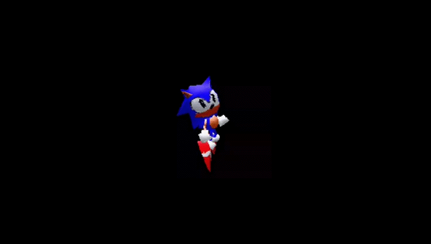

  

  

# Opa! Prazer em te ver por aqui. 👋

### Sou o Matheus Yudi, faço Ciência da Computação e pretendo ser um desenvolvedor full stack!

Pode parecer clichê, mas gosto mesmo é de ficar quebrando a cabeça resolvendo bugs e construindo paradas do zero que funcionam bem e parecem legais no navegador. O meu foco total agora é aprimorar as minhas habilidades e **me tornar um desenvolvedor Full Stack**. Quero dominar o processo de ponta a ponta: desde a parte bonita que você vê, até a lógica que acontece nos bastidores.

Estou sempre estudando e criando alguma coisa  e estou à procura de oportunidades para trabalhar e colocar meus códigos em produção real.

---

### 🤝 Entre em contato comigo

[LinkedIn](www.linkedin.com/in/matheus-yudi-kobayashi)
[Email](mykbatsta@gmail.com)
